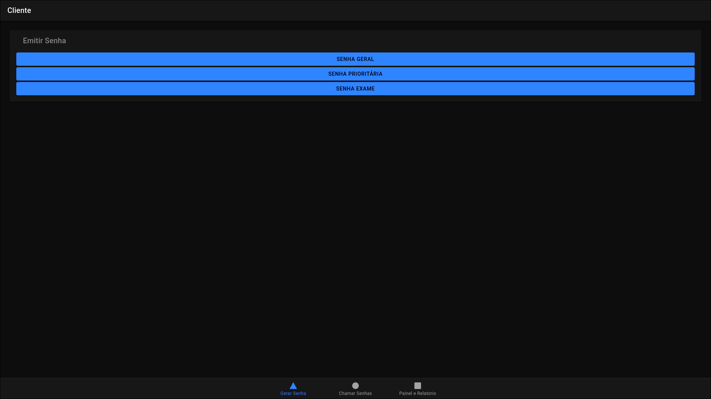
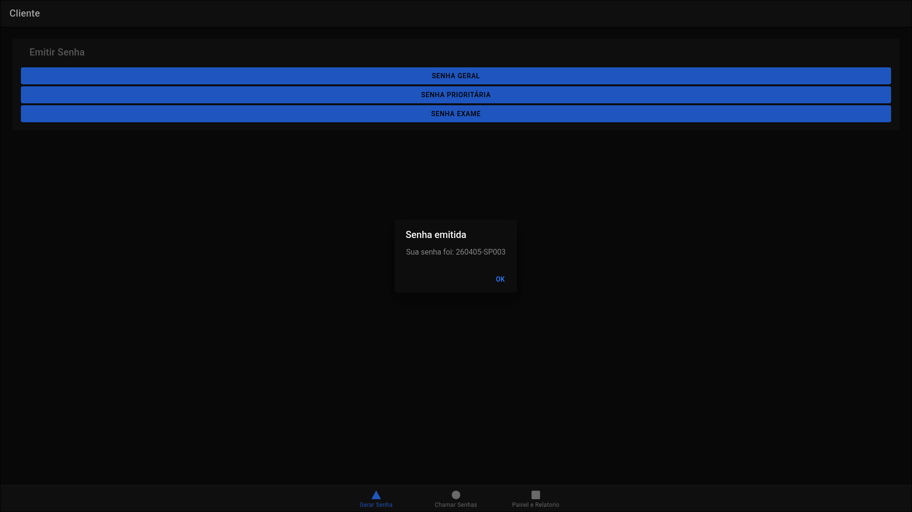
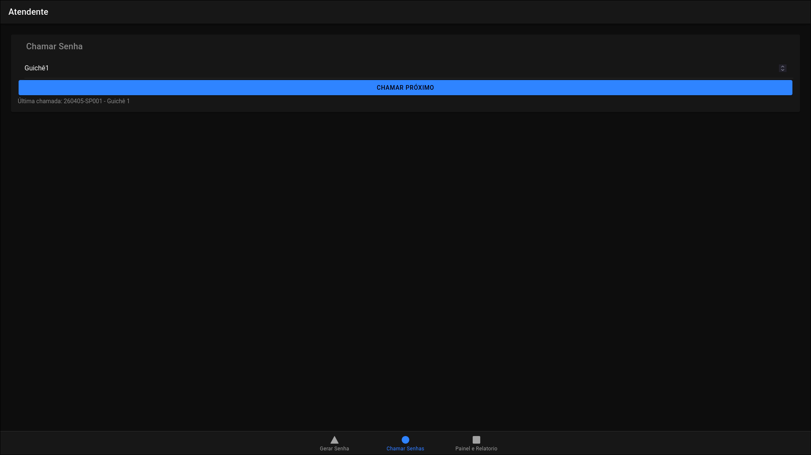
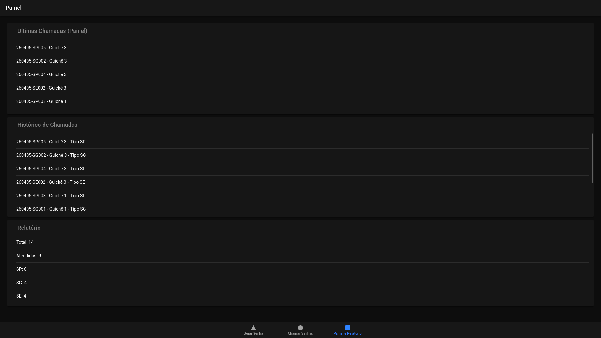

[Ir para integrantes do projeto com matrícula](#integrantes-do-projeto)

---

# Sistema de Controle de Atendimento - Mobile Tickets

## Visão Geral

Este projeto consiste no desenvolvimento de um sistema de gerenciamento de filas baseado em tickets (senhas), com foco no atendimento em laboratórios médicos.

Sistemas desse tipo são amplamente utilizados para organizar o fluxo de atendimento ao usuário, permitindo controle de filas, priorização e rastreabilidade dos atendimentos.

---

## Agentes do Sistema

O sistema é composto por três tipos de agentes:

- **AS — Agente Sistema**  
  Responsável pela emissão de senhas e controle geral do fluxo.

- **AA — Agente Atendente**  
  Responsável por chamar o próximo cliente e realizar o atendimento.

- **AC — Agente Cliente**  
  Interage com o totem para emissão de senha e aguarda chamada no painel.

---

## Tipos de Senha

O sistema trabalha com três categorias de atendimento:

- **SP — Senha Prioritária**  
- **SG — Senha Geral**  
- **SE — Senha para Retirada de Exames**

---

## Regra de Prioridade

A ordem de atendimento segue o padrão:

SP → (SE ou SG) → SP → (SE ou SG) → ...


### Regras:

- Sempre atender uma **SP** primeiro, se houver disponível.
- Em seguida:
  - atender uma **SE**, se existir;
  - caso contrário, atender uma **SG**.
- Evitar repetir o mesmo tipo consecutivamente, quando houver outras opções disponíveis.

---

## Guichês

- Não há especialização entre guichês.
- Qualquer guichê pode atender qualquer tipo de senha.

---

## Painel de Chamados

O painel deve:

- Exibir as **5 últimas senhas chamadas**.
- Mostrar:
  - número da senha
  - guichê de atendimento
- **Não exibir** a próxima senha da fila.

---

## Formato da Senha

Cada senha segue o padrão:

YYMMDD-PPSQ

### Onde:

- **YY** — Ano (2 dígitos)  
- **MM** — Mês (2 dígitos)  
- **DD** — Dia (2 dígitos)  
- **PP** — Tipo da senha (SP, SG, SE)  
- **SQ** — Sequência por tipo (reiniciada diariamente)

---

## Relatórios

O sistema deve gerar um relatório contendo:

- Quantidade total de senhas emitidas  
- Quantidade total de senhas atendidas  
- Quantidade de senhas emitidas por tipo  
- Quantidade de senhas atendidas por tipo  

### Relatório Detalhado

Para cada senha:

- Número da senha  
- Tipo  
- Guichê responsável  

> Caso a senha não tenha sido atendida, os campos de atendimento permanecem em branco.

---

## Imagens do projeto






---

## Ferramentas utilizadas

| Node.js | Angular | Ionic |
|---------|---------|--------|
| <div align="center"></div> | <div align="center"></div> | <div align="center"></div> |
| Node.js | Angular | Ionic Framework |

---

## Como executar o projeto

### Pré-requisitos

Antes de rodar o projeto, tenha instalado:

- Node.js
- Angular CLI
- Ionic CLI

---

### Frontend / Aplicação

```bash
# clonar o repositório
git clone https://github.com/ricardoo-azevedo/MobileTicketsIonic.git

# entrar na pasta raiz
cd MobileTicketIonic/mobileTickets

# instalar dependências
npm install

# rodar o projeto
ionic serve

```

--- 

## Integrantes do projeto

#### Grazielle Diniz Marques Araujo - 01831671

#### Adrielly Kauany Pereira dos Santos - 01835056

#### Francileidy Conceição da Silva - 01837744

#### José Ricardo Farias Azevedo - 01834551

#### Silvio Matheus da Silva Teixeira - 01831909

